# Intro to Machine Learning

## What is it?

According to the book, machine learning is the science of programming computers so they can _learn from data_. 

* (Aurthur Samuel, 1959) Machine learning is the field of study that gives computers the ability to learn without being explicitly programmed. 

## Example: The SPAM filter

## Naive approach

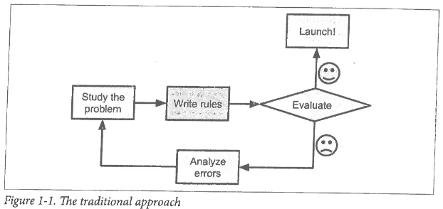

* You notice _4U_, _free_, _amazing_ are used a lot
* Then write code to stop these emails

----

But if the spammers notice they are being blocked, they will start using _4 you_ instead.

* If this happens you need to write more rules
* Your code will become exponentially large and unmanageable. 
* Thankfully there is a better way. 

## ML Approach

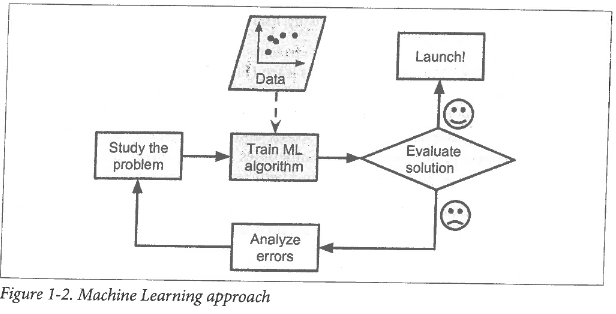

* All of this can be automated!

-------

Blocking SPAM is not the only thing ML is good for.  You can use it for

* Problems for which existing solutions require a lot rules
* Complex problems where there is not good traditional solutions
* Fluctuating environments
* Getting insights about large amounts of data

## There are three main tasks. 

- Supervised
- Unsupervised
- Reinforcement

## Supervised Learning

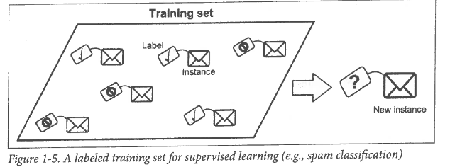

----

Types of supervised learning include: 

- Regression
- Decision Trees
- Random Forests
- Support Vector Machine
- Neural Networks

## Unsupervised Learning

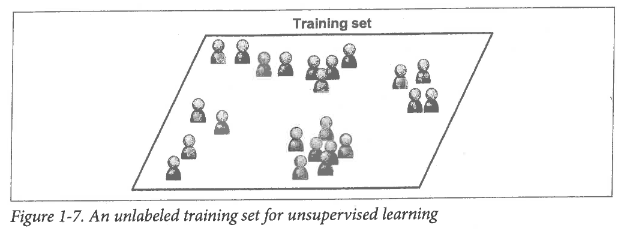
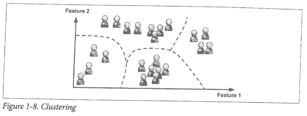

--------

Types of unsupervised learning include: 

- k-clusters
- Principle Component Analysis
- Expectation Maximization
- t-distributed Stochastic Neighbor Embedding
- Apriori
- Eclat

## Reinforcement

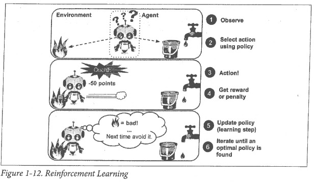

- AI
- AlphaGo

## Example: Life Satisfaction

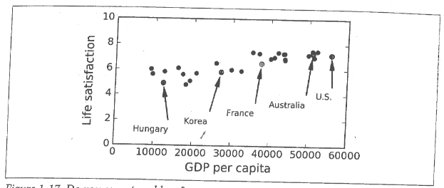

Can we find parameters $\theta_0$, $\theta_1$ for 

$$lifeSat = \theta_0+\theta_1 \cdot GDP?$$

-----

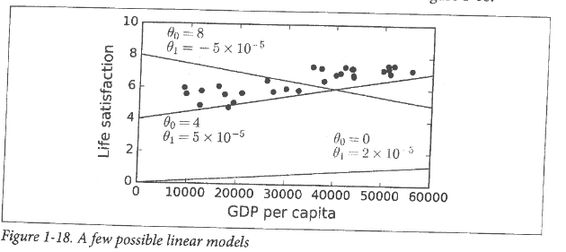

There are infinitely many to choose from, but there can be only one.

-----

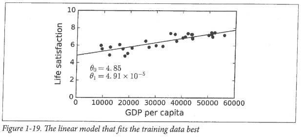

* The problem is, does this extend well when more data is added? 
* Turns out more countries exist!

------

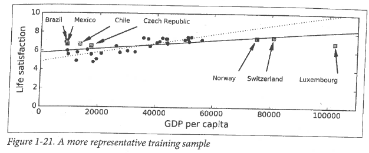

* The dotted line is our old model.
* But when we refit with new data, we get a different line.
* Notice it does not do such a great job for "poor" Luxembourg. 

## Challenges of ML

* Not enough training data.
	* Turns out all models perform the same when given enough data.
* Bad representation in data (Sampling Bias)
	* Page 25 has a nice example of this.
* Poor Quality Data 
	* Missing information
	* too many outliers
* Irrelevant Features
* Overfitting training data

----

An example of overfitting using the Lagrange polynomial.

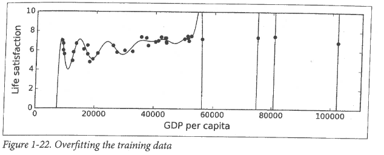

---

Overfitting happens when the model is too complex relative to the amount of noisiness of the training data. Solutions are 

* Simplify the model by selecting hone with fewer parameters (maybe just use $\theta_1$?)
* Gather more data (very expensive)
* reduce the noise (fill in missing info, remove outliers)

-----

In our situation, if we place bounds on $\theta_1$, we can then have two variables to "move around". This process is called **regularization**.

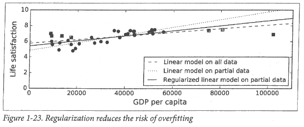

