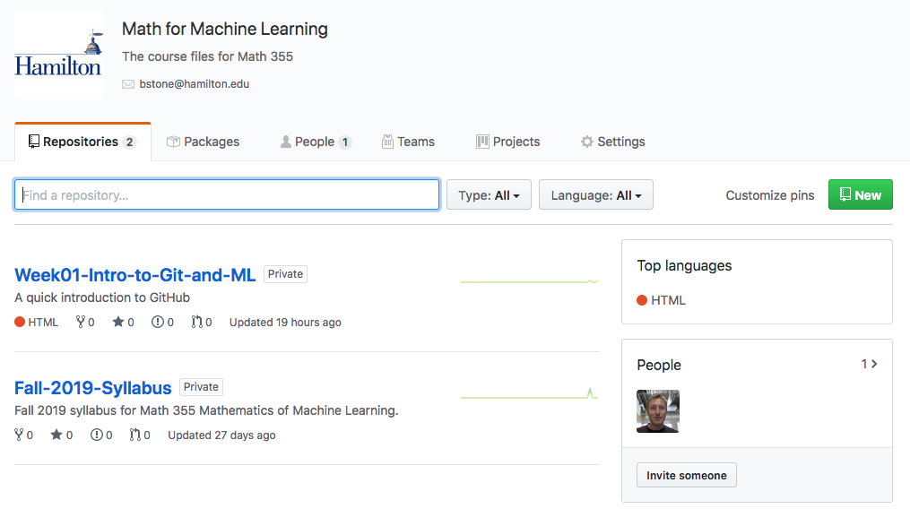

% Math 355: Math for Machine Learning 
% Fall 2019
% Branden Stone

# Day 1 Introduction to GitHub

## Getting started with Git

Today we will discuss the delivery method of all course materials, assignments, and projects. This method will rely on learning `git`. 

- According to [Wikipedia](https://en.wikipedia.org/wiki/Git_(software)), "Git is a version control system that is used for software development and other version control tasks. As a distributed revision control system it is aimed at speed, data integrity, and support for distributed, non-linear workflows." 
- Basically, it is a more sophisticated Dropbox and allows you to keep your code up to date across multiple platforms. 
- A complete walk through of Git can be found online at [`https://git-scm.com/book/en/v2`](https://git-scm.com/book/en/v2). 
- Today we will only learn the basics. 

## Sign up with GitHub

If you don't already have an account, you will need a GitHub account. You can do so here: [https://github.com/](https://github.com/).

- I'll wait here while you do this. 
- Once you are finished, come up and enter your username on my computer, this send out an email inviting you to join the class. 

## Welcome to the class!

> - Once you have accepted your invite, you now have access to the coures materials.
> - [`https://github.com/math-355`](https://github.com/math-355)
> - The page should look something like this. Feel free to poke around. 

## Mandatory Syllabus time.

You can find the syllabus as well as resources on the landing page [`https://github.com/math-355`](https://github.com/math-355)

## Cloning Forking a Repo

First, what is a repo and why would you want to do these things to it? __Repo__ is short for repository which is basically a directory of files and folders. Think of your GitHub account as a large folder containing other folders (repos). Each repo is a different project, or in this case, a weekly objective. If you just created a GitHub account, then you don't have any repos yet. We are going to change that.

This is where forking comes in. You need to copy the `Lab01-Intro-to-GitHub-Spring-2018` repo into your account. This way you can edit/add files. A __Fork__ of a repo is like a fork in a road. There is a main road (the original `Lab01-Intro-to-GitHub-Spring-2018` repo) and a fork off the road (your repo). At any time you are editing the forked repo (or traveling the forked road), you can go back to the original.  

Forking the a repo is super easy. All you need to do is click the fork button at the top of this page ([https://github.com/csc-171/Lab01-Intro-to-GitHub-Spring-2018](https://github.com/csc-171/Lab01-Intro-to-GitHub-Spring-2018)) and select the account to fork to. __Do this now, then scroll down to this spot on the new page.__ 

Bam! You have forked a repo! Congratulations. If all went well, you should see something like this at the top of the page:

The only difference is that your username should be displayed and not `b-stone`. I.e. you should see something like this, `YOURUSERNAME/Lab01-Intro-to-GitHub-Spring-2018`. 

__From now on, this is the first thing you should do when you start a lab in this class.__